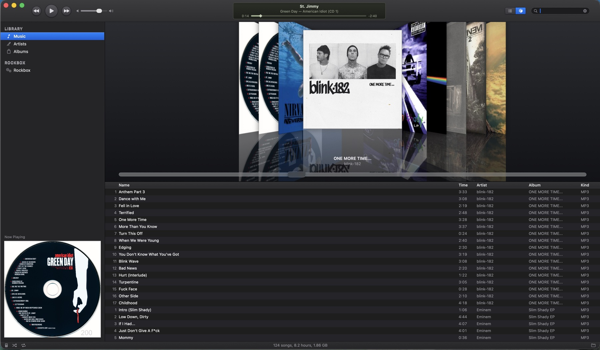
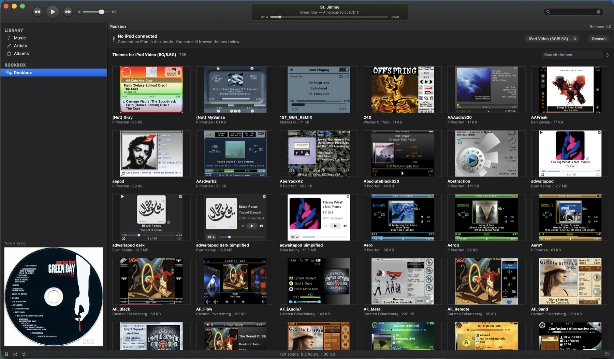

# iPod Connect

A native macOS app for people who kept their music library and still own
an iPod. It plays FLAC (which macOS's own Music app still won't), browses
your collection the way iTunes used to, sets up Rockbox on an iPod from
scratch, and syncs music to it, all without Finder, iTunes, or a Windows
PC.

Free, open source, universal binary (Apple silicon + Intel).



## Features

**Library**
- **Real FLAC support**: tags, cover art, sample rate and bit depth
  parsed natively from the FLAC container. No ffmpeg, no libFLAC.
- **Your existing folder**: point it at your music directory; nothing is
  moved, copied, or renamed. MP3, M4A, AAC, WAV, AIFF work too.
- **Three ways to browse**: a sortable song list (with a Quality column
  showing bit depth/sample rate or bitrate), an artist column browser,
  and an album cover grid.
- **The library updates itself**: drop a new album into the folder and
  it appears in a few seconds, no rescan needed.
- **iPod classic mode**: a working click wheel (drag it, or use a
  trackpad two-finger scroll), the split-screen menus, Now Playing,
  Cover art, Clock, and Settings.

**Rockbox**



- **Format the iPod as FAT32**, the format Rockbox requires, from inside
  the app. No Windows PC needed; that's just what Apple calls the format
  in Disk Utility.
- **Install Rockbox and its bootloader**, including the iPod Classic
  (6th/7th gen), which installs over USB with no administrator password.
  **Confirmed working on real Classic hardware.** Older iPods (1G-5.5G,
  mini, nano, Colour) use a different, firmware-partition route that
  isn't yet confirmed on hardware; it backs up your existing firmware
  first and stops if that backup fails.
- **Browse and install themes**: the full Rockbox catalogue with real
  previews, filtered to your iPod's screen size. Themes already on the
  device switch instantly.
- **Pre-flight warnings**: the app checks the iPod is FAT32 and that
  Rockbox is actually installed before it will flash a bootloader, since
  skipping either step is the most common way an install silently fails.

**Syncing**
- **Add and remove music** on a Rockboxed iPod, with real free-space
  tracking, no Finder or Music app involved. **Confirmed working on a real
  Rockboxed iPod Mini,** in addition to the Classic.

**Everything else**
- **Light and dark**: dark mode follows Apple's HIG palette; the iPod
  becomes the black anodized model.
- **Media keys and Now Playing**: the macOS Now Playing widget and your
  keyboard's play/pause keys work as expected.
- **iTunes-era keyboard shortcuts**: ⌘L to jump to the current song, ⌘F
  to search, ⇧⌘←/→ to skip albums, and more.

## Requirements

macOS 12 (Monterey) or later. Universal binary, runs natively on Apple
silicon and Intel.

## Installing

1. Download the latest `.zip` from
   [Releases](https://github.com/Davidjrsomper/ipod-connect/releases).
2. Unzip and drag **iPod Connect** to your Applications folder.
3. **First launch:** macOS will say it "cannot verify" the app. This is
   because it isn't signed with a paid Apple Developer certificate, not
   because anything is wrong with it. To open it:
   - **System Settings → Privacy & Security** → scroll down → **Open
     Anyway**, then launch it again and confirm, or
   - In Terminal: `xattr -dr com.apple.quarantine "/Applications/iPod Connect.app"`

   You only have to do this once.

Once installed, the app checks for updates automatically in the
background and applies them on the next launch, no prompts for routine
updates.

## Building from source

Requires the Swift toolchain (Xcode or Command Line Tools).

```bash
git clone https://github.com/Davidjrsomper/ipod-connect
cd ipod-connect
./build.sh
open "build/iPod Connect.app"
```

## Usage

| | |
|---|---|
| Choose your music folder | ⌘O |
| Rescan library | ⇧⌘R |
| Show selected song in Finder | ⌘R |
| Play / pause | Space |
| Next / previous track | ⌘→ / ⌘← |
| Next / previous album | ⇧⌘→ / ⇧⌘← |
| Skip 5 seconds | ⌥⌘→ / ⌥⌘← |
| Volume | ⌘↑ / ⌘↓ |
| Mute | ⌥⌘↓ |
| Go to current song | ⌘L |
| Find | ⌘F |
| Dark mode | ⇧⌘D |
| iPod view | ⇧⌘I |

In iPod view, drag around the click wheel to scroll, or use a two-finger
trackpad scroll. Tap MENU, ⏮, ⏭, ⏯ or the center button; menu rows are
also clickable directly.

## Honesty about hardware testing

Most of this app has been tested against real files and real FAT32
volumes. What's confirmed on real hardware so far, and what isn't yet,
clearly marked in the app itself too:

- **Bootloader install on the iPod Classic** is confirmed working on real
  hardware.
- **Syncing music to a Rockboxed iPod** is confirmed working on a real
  iPod Mini, in addition to the Classic.
- **Bootloader install on older iPods** (1G-5.5G, mini, nano, Colour) is
  not yet confirmed on real hardware, though the underlying tool
  (`ipodpatcher`) is Rockbox's own and widely used elsewhere. It backs up
  your firmware first and stops if that backup fails. (This is separate
  from syncing, above; a Mini synced successfully once Rockbox was on it,
  regardless of how the bootloader got there.)

If you try either path and it works (or doesn't), a report in
[Issues](https://github.com/Davidjrsomper/ipod-connect/issues) is
genuinely useful.

## Documentation

- [`docs/RELEASING.md`](docs/RELEASING.md): cutting a release
- [`docs/RELEASE_POLICY.md`](docs/RELEASE_POLICY.md): when a change
  warrants a release
- [`docs/DISTRIBUTION.md`](docs/DISTRIBUTION.md): code signing and how
  auto-updates work
- [`docs/GTM.md`](docs/GTM.md): positioning and audience

## Licensing

The app's own source (everything under `Sources/`) is [MIT
licensed](LICENSE), free to read, build, modify, and reuse.

Two vendored command-line tools that install the Rockbox bootloader are
GPL v2, taken from the Rockbox project itself, and shipped as **separate
executables** the app launches as subprocesses, never linked into the app
binary:

- [`Vendor/ipodpatcher/`](Vendor/ipodpatcher): firmware-partition install
  for iPod 1G-5.5G, mini, nano, Colour
- [`Vendor/mks5lboot/`](Vendor/mks5lboot): USB DFU install for the iPod
  Classic

Their source is included in this repository, as GPL requires.

## A note on the name

This project is not affiliated with, endorsed by, or connected to Apple
Inc. "iPod" and "iTunes" are trademarks of Apple Inc. Rockbox is an
independent open-source firmware project; this app installs it and is
not made by them.
